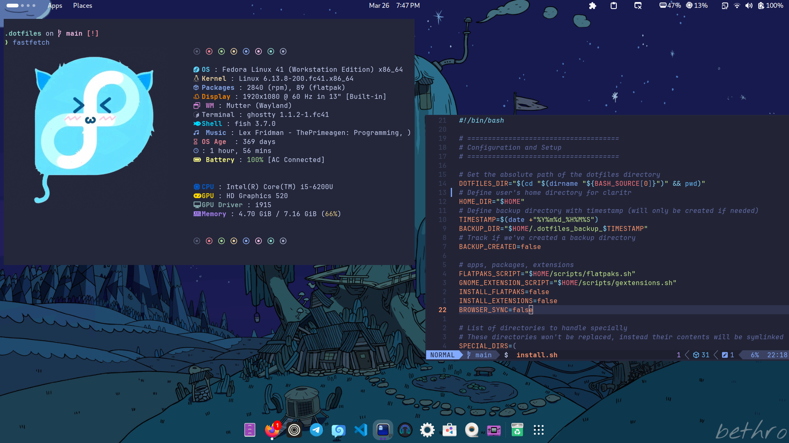

# Dotfiles

A collection of configuration files and scripts for my Linux environment. This repository contains my personal settings for various applications, terminal configurations, and system utilities, all designed to work together for a cohesive experience.




---
## 📋 Config's Included

| Category                     | Description                                             |
|------------------------------|---------------------------------------------------------|                                         
| [Fish Shell](/.config/fish/) | Configuration and custom functions                      |
| [Kitty Terminal](/.config/kitty/) | A fast GPU-based terminal emulator                 |
| [Ghostty Terminal](/.config/ghostty/) | Alternative terminal configuration             |
| [Neovim](/.config/nvim/) | Modern, improved version of Vim text editor               |
| [Conky](/.config/conky/Mimosa/) | System monitor with Mimosa theme                     |
| [Fastfetch](/.config/fastfetch/) | Faster alternative to Neofetch                      |                                        |
| [Flatpak Management](scripts/flatpaks.sh) | Installation and management of Flatpak apps |
| [GNOME Extensions](scripts/gextensions.sh) | Management of GNOME Shell extensions       |

---
## 🚀 Installation

Clone the repository to your `Projects` folder:

```bash
git clone https://github.com/username/dotfiles.git ~/Projects/.dotfiles #.dotfiles
```

Run the installation script:

```bash
cd ~/Projects/.dotfiles
./install.sh
```

<details>
<summary>Installation Options</summary>

The install script accepts several options:

| Option                | Description                                      |
|-----------------------|--------------------------------------------------|
| `--install-flatpaks`  | Install Flatpak applications from the list       |
| `--install-extensions`| Install GNOME extensions from the list           |
| `--browser-sync`      | Sync extensions from browser                     |

Example:
```bash
./install.sh --install-flatpaks --install-extensions
```

</details>

---

# 📝 Custom Commands

<details open>
<summary>Custom Commands and Aliases</summary>

| Command/Alias | Description                                      |
|---------------|--------------------------------------------------|
| `dots`        | Quick access to dotfiles                         |
| `proj`        | Quick access to Projects directory               |
| `mkcd`        | Create directory and cd into it                  |
| `dump`        | Export installed Flatpaks and GNOME extensions   |
| `cd` (`z`)    | Use zoxide for smarter directory navigation      |
| `nv`          | Neovim shortcut                                  |
| `frc`         | Edit fish config                                 |
| `src`         | Reload fish config                               |
| `gs`          | Git status                                       |
| `lg`          | LazyGit                                          |


</details>


> [!NOTE]  
> The aliases and commands listed above are defined in the Fish shell configuration file located at `~/.config/fish/config.fish`.

---

# 📦 Application Lists

| Application Type     | Applications                                      |
|----------------------|---------------------------------------------------|
| [Flatpak Applications](scripts/flatpaks.sh) | List of installed Flatpak applications            |
| [GNOME Extensions](scripts/gextensions.sh) | List of installed GNOME Shell extensions          |

> [!TIP]
> This scripts are for dumping application lists onto the `lists` directory.
> Run `dump` command to create list files.

---

# 📄 License
 These dotfiles are shared for reference and inspiration under MIT. Feel free to use and modify them for your personal use.